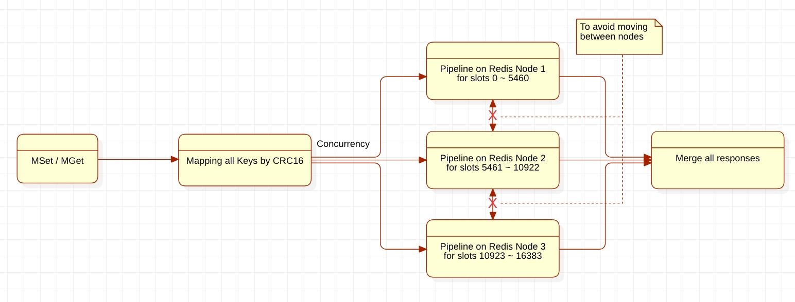

# easy-go-redis-cluster
easy-redis-go-cluster is a golang implementation of bulk operations in the Redis cluster client based on Go-redis. 


## The Intent



Supports:

- [Golang 1.7](https://go.dev/dl/)
- [Go-redis v8](https://github.com/go-redis/redis)

API docs: https://godoc.org/github.com/go-redis/redis.


## Installation

Install:

```shell
go get -u github.com/tonycbcd/easy-go-redis-cluster
```

Import:

```go
import "github.com/tonycbcd/easy-go-redis-cluster"
```


## Quickstart

```go
func ExampleNewRedisCluster() {
    cluster := redis.NewClusterClient(&redis.ClusterOptions{
        Addr:     []string{"localhost:6379"}
        Password: "", // no password set 
        ...           // as defined on https://pkg.go.dev/github.com/go-redis/redis/v8#ClusterOptions
    })  

    pong, err := cluster.Ping(context.Background()).Result()
    fmt.Println(pong, err)
    // Output: PONG <nil>
}

func TestMSetAndMGet(t *testing.T) {
    rdb, err := newRedis()
    if err != nil {
        fmt.Printf("new error: %s\n", err.Error())
        return
    }   

    assert := assert.New(t)
    testCases := []interface{}{}
    keys := []string{}
    for i := 0; i < 10; i++ {
        curKey := fmt.Sprintf("t%d", i)
        keys = append(keys, curKey)
        testCases = append(testCases, curKey)
        testCases = append(testCases, fmt.Sprintf("val-%d", i)) 
    }   

    res := rdb.MSet(testctx, 300*time.Second, testCases...)
    fmt.Printf("MSet Res: %#v\n", res)

    getRes := rdb.MGet(testctx, keys...)
    fmt.Printf("MGet Res: %#v\n", getRes)

    type data struct {
        T0  string `redis:"t0"`
        T1  string `redis:"t1"`
        T2  string `redis:"t2"`
        T3  string `redis:"t3"`
        T4  string `redis:"t4"`
        T5  string `redis:"t5"`
        T6  string `redis:"t6"`
        T7  string `redis:"t7"`
        T8  string `redis:"t8"`
        T9  string `redis:"t9"`
        T10 string `redis:"t10"`
    }   
    var d data
    err = getRes.Scan(&d)

    assert.Equal(err, nil, "test err failed.")
    assert.Equal(d, data{"val-0", "val-1", "val-2", "val-3", "val-4", "val-5", "val-6", "val-7", "val-8", "val-9", ""}, "test data failed.")
}
```


## MSet & MGet Benchmark

```shell
$ go test -run BenchmarkMSetAndMGet -bench=.
goos: linux
goarch: amd64
pkg: github.com/tonycbcd/easy-go-redis-cluster
cpu: Intel(R) Xeon(R) Platinum 8163 CPU @ 2.50GHz
BenchmarkMSetAndMGet-2          
Hits=62 Misses=2 Timeouts=0 TotalConns=60 IdleConns=60 StaleConns=0
Hits=62 Misses=2 Timeouts=0 TotalConns=60 IdleConns=60 StaleConns=0
Hits=63 Misses=1 Timeouts=0 TotalConns=60 IdleConns=60 StaleConns=0
Hits=63 Misses=1 Timeouts=0 TotalConns=60 IdleConns=60 StaleConns=0
Hits=62 Misses=2 Timeouts=0 TotalConns=60 IdleConns=60 StaleConns=0
Hits=61 Misses=2 Timeouts=0 TotalConns=60 IdleConns=59 StaleConns=0
Hits=63 Misses=1 Timeouts=0 TotalConns=60 IdleConns=60 StaleConns=0
Hits=63 Misses=1 Timeouts=0 TotalConns=60 IdleConns=60 StaleConns=0
Hits=63 Misses=1 Timeouts=0 TotalConns=60 IdleConns=60 StaleConns=0
Hits=62 Misses=2 Timeouts=0 TotalConns=60 IdleConns=60 StaleConns=0
Hits=62 Misses=2 Timeouts=0 TotalConns=60 IdleConns=60 StaleConns=0
Hits=62 Misses=2 Timeouts=0 TotalConns=60 IdleConns=60 StaleConns=0
Hits=62 Misses=2 Timeouts=0 TotalConns=60 IdleConns=60 StaleConns=0
Hits=62 Misses=2 Timeouts=0 TotalConns=60 IdleConns=60 StaleConns=0
Hits=62 Misses=2 Timeouts=0 TotalConns=60 IdleConns=60 StaleConns=0
Hits=62 Misses=2 Timeouts=0 TotalConns=60 IdleConns=60 StaleConns=0
Hits=62 Misses=2 Timeouts=0 TotalConns=60 IdleConns=60 StaleConns=0
1000000000               0.3042 ns/op
PASS
ok      github.com/tonycbcd/easy-go-redis-cluster       6.102s
```


## How to quickly build a test Redis Cluster in Docker

Create the Redis node folders:

```shell
root# for i in {8001..8006}; do mkdir -p /opt/redis-cluster/$i/data; done 
```

Write a docker-compose.yml:

```shell
root# echo "version: '1'\n\nservices:" > docker-compose.yml
root# for i in {1..6}; do echo " redis$i: \n  image: publicisworldwide/redis-cluster\n  restart: always\n  volumes:\n   - /opt/redis-cluster/800$i/data:/data\n  environment:\n   - REDIS_PORT=800$i\n  ports:  \n    - '800$i:800$i'       # Service port\n    - '1800$i:1800$i'   # Cluster port\n" >> docker-compose.yml; done
```

Init and start running all Redis nodes:

```shell
root# docker-compose up -d
```

Create a Redis Cluster

```shell
root# docker run  --rm -it inem0o/redis-trib create --replicas 1 172.17.0.1:8001 172.17.0.1:8002 172.17.0.1:8003 172.17.0.1:8004 172.17.0.1:8005 172.17.0.1:8006
```

Check all Redis nodes status

```shell
root# docker-compose ps

         Name                       Command               State                                  Ports                                
--------------------------------------------------------------------------------------------------------------------------------------
dockercompose_redis1_1   /usr/local/bin/entrypoint. ...   Up      0.0.0.0:18001->18001/tcp, 6379/tcp, 7000/tcp, 0.0.0.0:8001->8001/tcp
dockercompose_redis2_1   /usr/local/bin/entrypoint. ...   Up      0.0.0.0:18002->18002/tcp, 6379/tcp, 7000/tcp, 0.0.0.0:8002->8002/tcp
dockercompose_redis3_1   /usr/local/bin/entrypoint. ...   Up      0.0.0.0:18003->18003/tcp, 6379/tcp, 7000/tcp, 0.0.0.0:8003->8003/tcp
dockercompose_redis4_1   /usr/local/bin/entrypoint. ...   Up      0.0.0.0:18004->18004/tcp, 6379/tcp, 7000/tcp, 0.0.0.0:8004->8004/tcp
dockercompose_redis5_1   /usr/local/bin/entrypoint. ...   Up      0.0.0.0:18005->18005/tcp, 6379/tcp, 7000/tcp, 0.0.0.0:8005->8005/tcp
dockercompose_redis6_1   /usr/local/bin/entrypoint. ...   Up      0.0.0.0:18006->18006/tcp, 6379/tcp, 7000/tcp, 0.0.0.0:8006->8006/tcp
```

